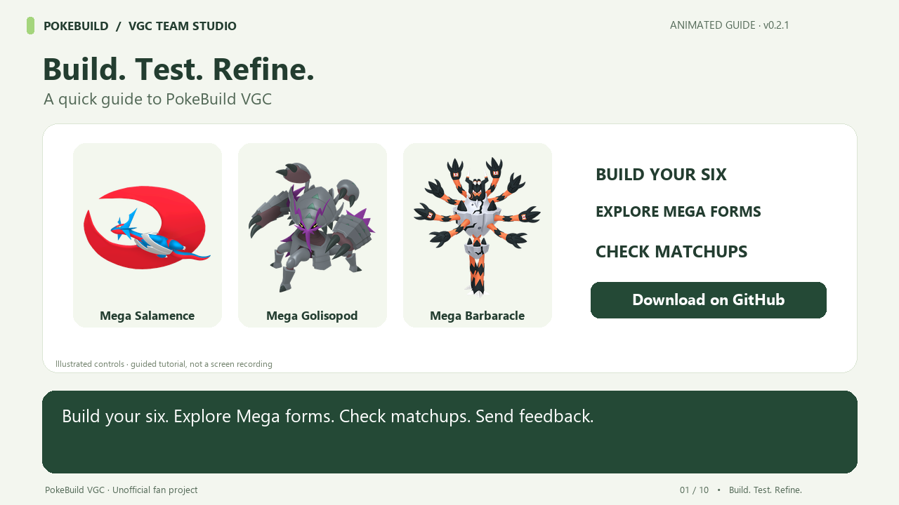

# PokeBuild VGC

An unofficial Pokémon Champions VGC team builder for Windows, with damage calculations, matchup tools, and modern HOME-style images. This public repository hosts downloads and feedback; the application source is maintained separately.

## Download for Windows

**[Download PokeBuild VGC 0.2.1 installer](https://github.com/SShadowstorm/PokeBuild-VGC-feedback/releases/download/v0.2.1/PokeBuild-VGC-Setup-0.2.1.exe)**

[Latest release and installation notes](https://github.com/SShadowstorm/PokeBuild-VGC-feedback/releases/latest)

Requires Windows 10/11, 64-bit x64. Download the installer and run it. Node.js and separate data downloads are not required. The app includes offline calculation data and images for 374 forms, including all 81 Mega forms.

This preview installer is unsigned. Windows may display an unknown-publisher or SmartScreen warning. Only install a copy from this release or a trusted source.

## Quick-start tutorial

**[Download the 3-minute tutorial video (MP4)](https://github.com/SShadowstorm/PokeBuild-VGC-feedback/releases/download/v0.2.1/PokeBuild-VGC-Quick-Start-0.2.1.mp4)** · [Subtitles (SRT)](https://github.com/SShadowstorm/PokeBuild-VGC-feedback/releases/download/v0.2.1/PokeBuild-VGC-Quick-Start-0.2.1.srt) · [Read the transcript](https://github.com/SShadowstorm/PokeBuild-VGC-feedback/blob/main/docs/tutorial-transcript.txt)

An animated walkthrough with English narration and on-screen captions. Learn installation, building a team, Mega Evolution, checking damage and matchups, importing/exporting teams, and sending feedback. Controls are illustrated rather than recorded from the app.

## Report a bug or suggest an improvement

Use the app’s **Bugs & suggestions** button or [create an issue](https://github.com/SShadowstorm/PokeBuild-VGC-feedback/issues/new/choose). Include the app version and, for bugs, the steps to reproduce, expected result, and actual result. Screenshots help; remove any personal information first.

Reports are public and require a GitHub account. Without an account, use **Save .txt instead** in the app and send the file to the person who shared it with you. Teams stay on your computer and are not uploaded automatically.

Feedback is reviewed by the developer. Filing an issue does not trigger an automatic fix or update.

Pokémon names and assets belong to Nintendo, Game Freak, and The Pokémon Company. This is an unofficial fan project.
